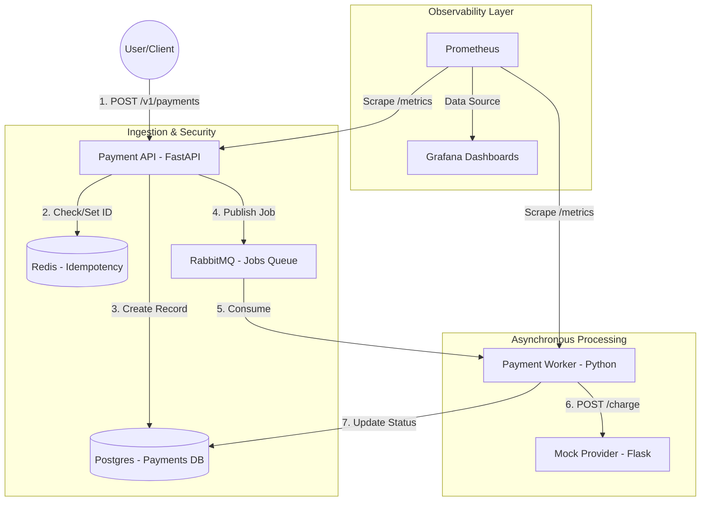

# Fault-Tolerant Payment Engine

A high-concurrency, asynchronous payment processing system built with **FastAPI**, **RabbitMQ**, and **Redis**, deployed on **AWS EKS** via **Terraform** and **GitHub Actions**.

## The Architecture
This project demonstrates a production-grade "Reliable Worker" pattern, ensuring that payments are never lost and customers are never double-charged.

### Core Components:
* **Payment API (FastAPI):** Handles incoming requests, enforces idempotency, and offloads processing to RabbitMQ.
* **Idempotency Layer (Redis):** Uses `X-Request-ID` headers to prevent duplicate transactions.
* **Message Broker (RabbitMQ):** Acts as a durable buffer between the API and the worker.
* **Payment Worker (Python):** Consumes jobs, communicates with external providers, and manages state transitions.
* **Observability (Prometheus & Grafana):** Full-stack monitoring of system health and custom payment metrics.

## Technical Challenges & Solutions

### 1. Internal K8s Networking (The DNS Hurdle)
**Challenge:** The Worker service initially failed to reach the Provider mock due to internal DNS resolution issues within the VPC.
**Solution:** Diagnosed the K8s DNS resolution path and corrected the internal provider URL to follow the pattern `http://payment-provider.default.svc.cluster.local`. Verified connectivity using ephemeral debug containers.

### 2. Logic Robustness (Case Sensitivity)
**Challenge:** Payments were hanging in 'PENDING' because the Mock Provider returned "SUCCESS" while the worker logic looked for "success".
**Solution:** Implemented string normalization (`.upper()`) across the processing pipeline to ensure state machine transitions are robust against external API variations.

### 3. Distributed Idempotency
**Challenge:** Risk of duplicate charges during network retries or client-side double-clicks.
**Solution:** Implemented a Redis-backed locking mechanism using the `X-Request-ID` header. This ensures that the system is idempotent, even if the API receives the same request multiple times.

## Observability
The system is fully instrumented using the `kube-prometheus-stack`. Key metrics monitored include:
* **Throughput:** Payment success/failure rates via custom Prometheus counters.
* **Latency:** Time spent processing payments through the worker.
* **Saturation:** CPU and Memory utilization across all microservices to inform scaling decisions.

## Deployment & Migration
This infrastructure is fully account-agnostic and managed via **Terraform**.

### To Re-run in a New Account:
1.  **Infrastructure:** Run `terraform apply` in `infra/terraform/`.
2.  **Secrets:** Update `AWS_ACCESS_KEY_ID` and `AWS_SECRET_ACCESS_KEY` in GitHub Secrets.
3.  **Deploy:** Push to the `master` branch to trigger the automated **GitHub Actions** deployment.

---

## Project Gallery

### 1. Automated CI/CD Pipeline
Proof of account-agnostic deployment across AWS environments.

### 2. Infrastructure Monitoring
Real-time visibility into microservices health using Prometheus and Grafana.

### 3. Orchestration State
Current state of the 5-service cluster in the new AWS environment.

